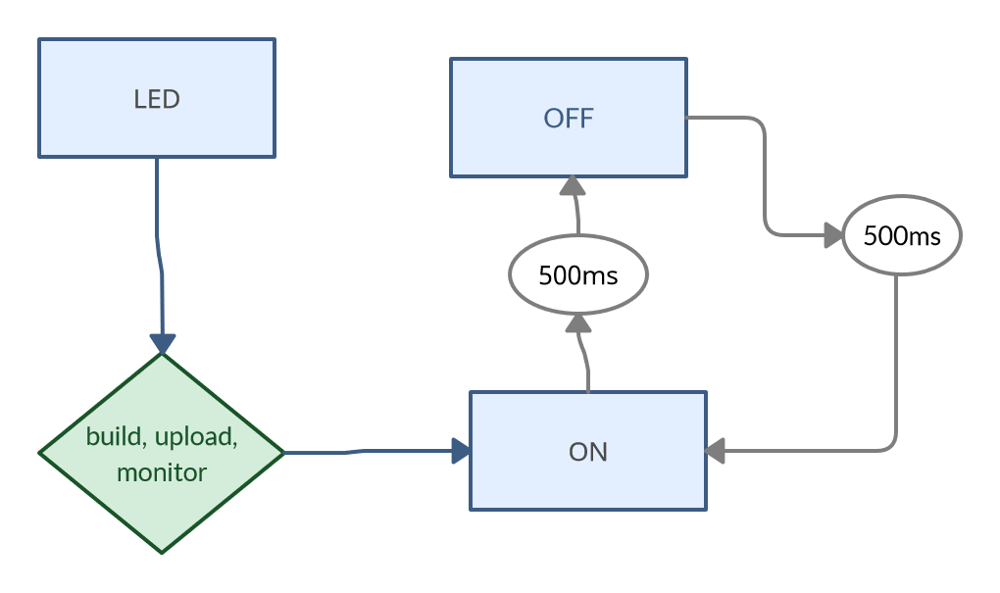
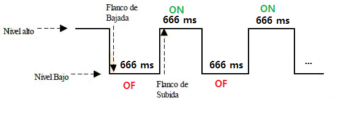
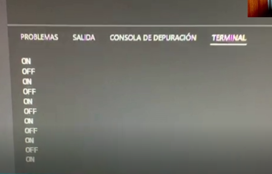

### Oriol Garcia Moreiras
###                                    </p>
    Processadors Digitals

</p>

# PRÁCTICA 1  :  BLINK

## Materiales

Placa ESP32,
Resistencia (en mi caso 100k),
LED,
Cables, y
Protoboard.

## </br>  1.1 Código Blink 

#include <Arduino.h>

#define LED 16

void setup(){

Serial.begin(9600);
pinMode(LED,OUTPUT);

}

void loop(){

    digitalWrite(LED,HIGH);
    Serial.println("ON");
    delay(666);
    digitalWrite(LED, LOW);
    Serial.println("OFF");
     delay(666);
}

## </br> 1.2 Código Blink a partir de la función mytime

#include <Arduino.h>

#define LED 16
unsigned long myTime;

void setup(){
Serial.begin(9600);
pinMode(LED,OUTPUT);

}

void loop(){

  Serial.println(myTime);
  myTime = millis();
  while(millis()<myTime+1000);
  // delay(1000);
  digitalWrite(LED,HIGH);
  Serial.println("ON");

  myTime = millis();
  while(millis()<myTime+666);
  // delay(666);
  digitalWrite(LED,HIGH);
  Serial.println("OFF");
  digitalWrite(LED,LOW);
  myTime = millis();
  while(millis()<myTime+666);
  // delay(666);

}
  

## </br>  2.Diagrama De Flujo

Como podemos comprobar en la siguiente imagen, vemos un bucle, el cual consiste en encenderse el LED y apagarse cada 500 ms (medio segundo). 

```mermaid
    LED-->|Build, Upload and Monitor;
    ON-->|666 ms|OFF;
    OFF-->|666 ms|ON;
```


## </br>  3.Diagrama De Tiempos

Como podemos comprobar hay un flanco de subida en la señal cuando se enciende nuestro LED y uno de bajada cuando este se apaga:




## </br>  ¿Cuál es el tiempo libre que tiene el procesador ?

El tiempo libre que tiene el procesador en mi caso es de 0,666 segundos (DELAY)


## </br>  SALIDAS

Las salidas del programa es basicamente una impresión de cuando el led se enciende (ON) o se apaga (OFF).

Salida por el puerto serie:


