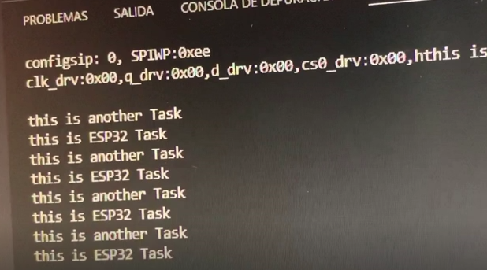
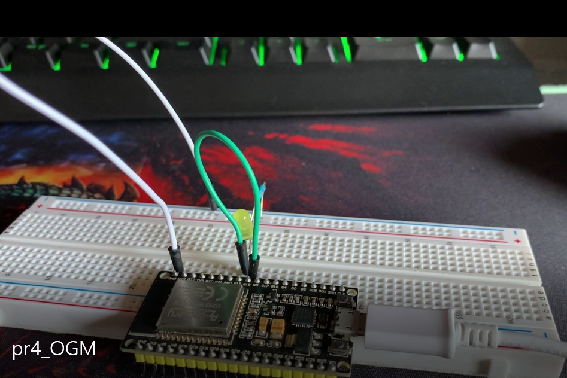
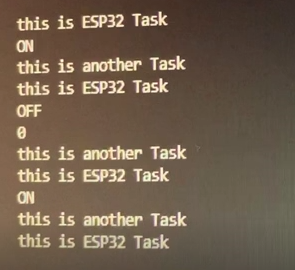

### Oriol Garcia Moreiras
###                                    

    Processadors Digitals

#   PRÁCTICA 4  :   SISTEMAS OPERATIVOS EN TIEMPO REAL

## Materiales

Placa ESP32 (nuestra placa),
1 LED,
Cables (Para conectar el led, la resistencia y la placa),
Protoboard (será nuestro lugar de trabajo),
Resistencia entre 100-330 ohms, en mi caso he escogido una de 330 ohms y
Cable para conectar la placa al ordenador (PC)

##   4.1 Sistema operativo en tiempo real (solo placa)
#include <Arduino.h>

void anotherTask(void * parameter);

void setup(){
  Serial.begin(115200);
  /* we create a new task here */
  xTaskCreate(
  anotherTask, /* Task function. */
  "another Task", /* name of task. */
  10000, /* Stack size of task */
  NULL, /* parameter of the task */
  1, /* priority of the task */
  NULL); /* Task handle to keep track of created task */
}
/* the forever loop() function is invoked by Arduino ESP32 loopTask */
void loop(){
  Serial.println("this is ESP32 Task");
  delay(1000);
}
/* this function will be invoked when additionalTask was created */
void anotherTask( void * parameter ){
  /* loop forever */
  for(;;){
    Serial.println("this is another Task");
    delay(1000);
  }
  /* delete a task when finish,
  this will never happen because this is infinity loop */
  vTaskDelete( NULL );
}

##   4.2 (poner led pin 18 y resistencia (100-330 ohms))
#include <Arduino.h>
#define LED 18
#define interruptPin 0
unsigned long myTime;

void Task1(void * parameter);
void anotherTask(void * parameter);

void setup(){
  Serial.begin(115200);
  /* we create a new task here */
  xTaskCreate(
  anotherTask, /* Task function. */
  "another Task", /* name of task. */
  10000, /* Stack size of task */
  NULL, /* parameter of the task */
  1, /* priority of the task */
  NULL); /* Task handle to keep track of created task */
  xTaskCreate(
  Task1, /* Task function. */
  "Task 1", /* name of task. */
  10000, /* Stack size of task */
  NULL, /* parameter of the task */
  1, /* priority of the task */
  NULL);
}

void loop(){
  Serial.println("this is ESP32 Task");
  delay(1000);
}

void anotherTask( void * parameter ){
  /* loop forever */
  for(;;){
    Serial.println("this is another Task");
    delay(1000);
  }
  vTaskDelete( NULL );
}

void Task1(void * parameter){
  pinMode(LED,OUTPUT);
  for(;;){
    Serial.println(myTime); 
    delay(666);    
    digitalWrite(LED,HIGH);
    Serial.println("ON");
    delay(666);
    digitalWrite(LED,HIGH);
    Serial.println("OFF");
    digitalWrite(LED,LOW);
    delay(666);
  }
}

##   4.2.1 Wifi TAREAS (poner led pin 18 y resistencia (100-330 ohms)), es lo mismo pero pones el codigo en internet
#include <WiFi.h>
#include <ESPmDNS.h>
#include <WiFiUdp.h>
#include <ArduinoOTA.h>

const char* ssid = "Xiaomi_11T_Pro";
const char* password = "f5cbd8a82232";

#define LED 18
String version ="OGM";

void Task1(void * parameter);
void anotherTask(void * parameter);
void Task2(void * parameter);

void setup(){
  Serial.begin(115200);
  /* we create a new task here */
  xTaskCreate(
  anotherTask, /* Task function. */
  "another Task", /* name of task. */
  10000, /* Stack size of task */
  NULL, /* parameter of the task */
  1, /* priority of the task */
  NULL); /* Task handle to keep track of created task */
  xTaskCreate(
  Task1, /* Task function. */
  "Task 1", /* name of task. */
  10000, /* Stack size of task */
  NULL, /* parameter of the task */
  1, /* priority of the task */
  NULL);
  xTaskCreate(
  Task2, /* Task function. */
  "Task 2", /* name of task. */
  10000, /* Stack size of task */
  NULL, /* parameter of the task */
  1, /* priority of the task */
  NULL);

}

/* the forever loop() function is invoked by Arduino ESP32 loopTask */
void loop(){
  Serial.println(version);
  Serial.println("this is ESP32 Task");
  delay(1000);
}
/* this function will be invoked when additionalTask was created */
void anotherTask( void * parameter ){
  /* loop forever */
  for(;;){
    Serial.println("this is another Task");
    delay(1000);
  }
  /* delete a task when finish,
  this will never happen because this is infinity loop */
  vTaskDelete( NULL );
}

void Task1(void * parameter){
  pinMode(LED,OUTPUT);
  for(;;){
    delay(500);    
    digitalWrite(LED,HIGH);
    Serial.println("ON");
    delay(500);
    digitalWrite(LED,HIGH);
    Serial.println("OFF");
    digitalWrite(LED,LOW);
    delay(500);
  }
}

void Task2(void * parameter){
  Serial.begin(115200);
  Serial.println("Booting");
  WiFi.mode(WIFI_STA);
  WiFi.begin(ssid, password);
  while (WiFi.waitForConnectResult() != WL_CONNECTED) {
    Serial.println("Connection Failed! Rebooting...");
    delay(5000);
    ESP.restart();
  }

  ArduinoOTA.setHostname("Oriol");

  ArduinoOTA
    .onStart( {
      String type;
      if (ArduinoOTA.getCommand() == U_FLASH)
        type = "sketch";
      else // U_SPIFFS
        type = "filesystem";

      // NOTE: if updating SPIFFS this would be the place to unmount SPIFFS using SPIFFS.end()
      Serial.println("Start updating " + type);
    })
    .onEnd( {
      Serial.println("\nEnd");
    })
    .onProgress( {
      Serial.printf("Progress: %u%%\r", (progress / (total / 100)));
    })
    .onError( {
      Serial.printf("Error[%u]: ", error);
      if (error == OTA_AUTH_ERROR) Serial.println("Auth Failed");
      else if (error == OTA_BEGIN_ERROR) Serial.println("Begin Failed");
      else if (error == OTA_CONNECT_ERROR) Serial.println("Connect Failed");
      else if (error == OTA_RECEIVE_ERROR) Serial.println("Receive Failed");
      else if (error == OTA_END_ERROR) Serial.println("End Failed");
    });

  ArduinoOTA.begin();
  Serial.println("Ready");
  Serial.print("IP address: ");
  Serial.println(WiFi.localIP());

  for(;;){
    ArduinoOTA.handle();
  }
}

##   Sistema operativo en tiempo real (solo placa)
En esta primera parte veremos como a partir de nuestro código, la placa ESP32 y el cable para conectarla al ordenador podremos crear varias tareas. En este caso la primera tarea será "this is ESP32 Task" y la segunda será "this is another Task". Previamente, tendremos que darle prioridad a las tareas, y el programador ejecutará primero la tarea de mayor prioridad.

A continuación se muestra la salida por el puerto serie:

  Como podemos observar, la salida es básicamente una impresión de las tareas que hace dependiendo de su prioridad.

##    Wifi TAREAS (led)
En esta segunda parte aprenderemos a usar dos tareas que afectaran a nuestro led, la primera tarea lo encenderá (ON) y la segunda lo apagará (OFF). 

Circuito:

A continuación se muestra la salida por el puerto serie:

