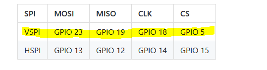
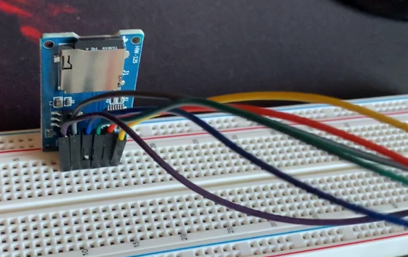
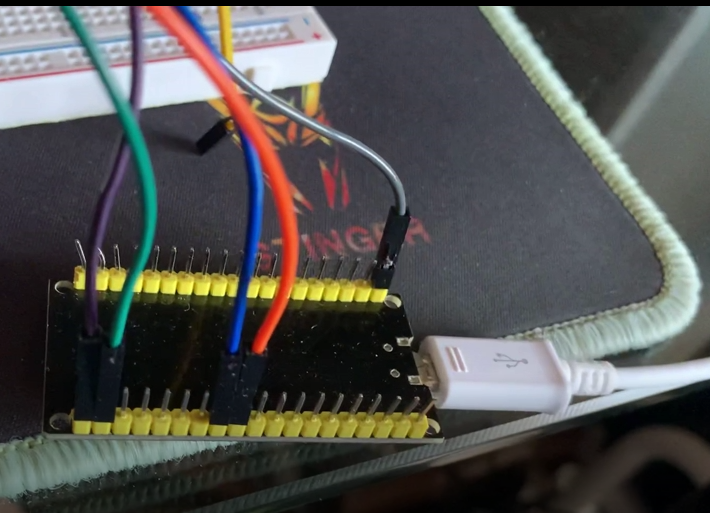

### Oriol Garcia Moreiras
###                                    

    Processadors Digitals

#   PRÁCTICA 6  :   Buses de comunicación II (SPI)

## Materiales

Placa ESP32 y cable para conectarla al ordenador, 
Lector microSD,
RFID-RC522,
Targeta NFC
Cables y
1 Protoboard

##   6.1 Código  LECTURA/ESCRITURA DE MEMORIA SD
#include <Arduino.h>

/*
  Rui Santos
  Complete project details at https://RandomNerdTutorials.com/esp32-microsd-card-arduino/
  
  This sketch can be found at: Examples > SD(esp32) > SD_Test
*/

#include "FS.h"
#include "SD.h"
#include "SPI.h"

void listDir(fs::FS &fs, const char * dirname, uint8_t levels){
  Serial.printf("Listing directory: %s\n", dirname);

  File root = fs.open(dirname);
  if(!root){
    Serial.println("Failed to open directory");
    return;
  }
  if(!root.isDirectory()){
    Serial.println("Not a directory");
    return;
  }

  File file = root.openNextFile();
  while(file){
    if(file.isDirectory()){
      Serial.print("  DIR : ");
      Serial.println(file.name());
      if(levels){
        listDir(fs, file.name(), levels -1);
      }
    } else {
      Serial.print("  FILE: ");
      Serial.print(file.name());
      Serial.print("  SIZE: ");
      Serial.println(file.size());
    }
    file = root.openNextFile();
  }
}

void createDir(fs::FS &fs, const char * path){
  Serial.printf("Creating Dir: %s\n", path);
  if(fs.mkdir(path)){
    Serial.println("Dir created");
  } else {
    Serial.println("mkdir failed");
  }
}

void removeDir(fs::FS &fs, const char * path){
  Serial.printf("Removing Dir: %s\n", path);
  if(fs.rmdir(path)){
    Serial.println("Dir removed");
  } else {
    Serial.println("rmdir failed");
  }
}

void readFile(fs::FS &fs, const char * path){
  Serial.printf("Reading file: %s\n", path);

  File file = fs.open(path);
  if(!file){
    Serial.println("Failed to open file for reading");
    return;
  }

  Serial.print("Read from file: ");
  while(file.available()){
    Serial.write(file.read());
  }
  file.close();
}

void writeFile(fs::FS &fs, const char * path, const char * message){
  Serial.printf("Writing file: %s\n", path);

  File file = fs.open(path, FILE_WRITE);
  if(!file){
    Serial.println("Failed to open file for writing");
    return;
  }
  if(file.print(message)){
    Serial.println("File written");
  } else {
    Serial.println("Write failed");
  }
  file.close();
}

void appendFile(fs::FS &fs, const char * path, const char * message){
  Serial.printf("Appending to file: %s\n", path);

  File file = fs.open(path, FILE_APPEND);
  if(!file){
    Serial.println("Failed to open file for appending");
    return;
  }
  if(file.print(message)){
      Serial.println("Message appended");
  } else {
    Serial.println("Append failed");
  }
  file.close();
}

void renameFile(fs::FS &fs, const char * path1, const char * path2){
  Serial.printf("Renaming file %s to %s\n", path1, path2);
  if (fs.rename(path1, path2)) {
    Serial.println("File renamed");
  } else {
    Serial.println("Rename failed");
  }
}

void deleteFile(fs::FS &fs, const char * path){
  Serial.printf("Deleting file: %s\n", path);
  if(fs.remove(path)){
    Serial.println("File deleted");
  } else {
    Serial.println("Delete failed");
  }
}

void testFileIO(fs::FS &fs, const char * path){
  File file = fs.open(path);
  static uint8_t buf[512];
  size_t len = 0;
  uint32_t start = millis();
  uint32_t end = start;
  if(file){
    len = file.size();
    size_t flen = len;
    start = millis();
    while(len){
      size_t toRead = len;
      if(toRead > 512){
        toRead = 512;
      }
      file.read(buf, toRead);
      len -= toRead;
    }
    end = millis() - start;
    Serial.printf("%u bytes read for %u ms\n", flen, end);
    file.close();
  } else {
    Serial.println("Failed to open file for reading");
  }

  file = fs.open(path, FILE_WRITE);
  if(!file){
    Serial.println("Failed to open file for writing");
    return;
  }

  size_t i;
  start = millis();
  for(i=0; i<2048; i++){
    file.write(buf, 512);
  }
  end = millis() - start;
  Serial.printf("%u bytes written for %u ms\n", 2048 * 512, end);
  file.close();
}
#define BUZZER 26

void setup(){
  Serial.begin(115200);
  if(!SD.begin(5)){
    Serial.println("Card Mount Failed");
    return;
  }
  uint8_t cardType = SD.cardType();
  pinMode(BUZZER,OUTPUT);
  digitalWrite(BUZZER,HIGH);
  

  if(cardType == CARD_NONE){
    Serial.println("No SD card attached");
    return;
  }

  digitalWrite(BUZZER,LOW);
  delay(20);
  digitalWrite(BUZZER,HIGH);
  Serial.print("SD Card Type: ");
  if(cardType == CARD_MMC){
    Serial.println("MMC");
  } else if(cardType == CARD_SD){
    Serial.println("SDSC");
  } else if(cardType == CARD_SDHC){
    Serial.println("SDHC");
  } else {
    Serial.println("UNKNOWN");
  }

  uint64_t cardSize = SD.cardSize() / (1024 * 1024);
  Serial.printf("SD Card Size: %lluMB\n", cardSize);

  listDir(SD, "/", 0);
  createDir(SD, "/mydir");
  listDir(SD, "/", 0);
  removeDir(SD, "/mydir");
  listDir(SD, "/", 2);
  writeFile(SD, "/hello.txt", "Hello ");
  appendFile(SD, "/hello.txt", "World!\n");
  readFile(SD, "/hello.txt");
  deleteFile(SD, "/foo.txt");
  renameFile(SD, "/hello.txt", "/foo.txt");
  readFile(SD, "/foo.txt");
  testFileIO(SD, "/test.txt");
  Serial.printf("Total space: %lluMB\n", SD.totalBytes() / (1024 * 1024));
  Serial.printf("Used space: %lluMB\n", SD.usedBytes() / (1024 * 1024));
}

void loop(){

  digitalWrite(BUZZER,HIGH);
  delay(1000);
  digitalWrite(BUZZER,LOW);
  delay(20);
  digitalWrite(BUZZER,HIGH);
  delay(100);
  digitalWrite(BUZZER,LOW);
  delay(20);

}

##   3.2 Código LECTURA DE ETIQUETA RFID
#include <Arduino.h>
#include <MFRC522.h> //library responsible for communicating with the module RFID-RC522
#include <SPI.h> //library responsible for communicating of SPI bus
#define SS_PIN    21
#define RST_PIN   22
#define SIZE_BUFFER     18
#define MAX_SIZE_BLOCK  16
#define greenPin     12
#define redPin       32
//used in authentication
MFRC522::MIFARE_Key key;
//authentication return status code
MFRC522::StatusCode status;
// Defined pins to module RC522
MFRC522 mfrc522(SS_PIN, RST_PIN); 
int menu();
void readingData();
void writingData();
void setup() 
{
  Serial.begin(115200);
  SPI.begin(); // Init SPI bus
  pinMode(greenPin, OUTPUT);
  pinMode(redPin, OUTPUT);
  
  // Init MFRC522
  mfrc522.PCD_Init(); 
  Serial.println("Approach your reader card...");
  Serial.println();
}

void loop() 
{
   // Aguarda a aproximacao do cartao
   //waiting the card approach
  if ( ! mfrc522.PICC_IsNewCardPresent()) 
  {
    return;
  }
  // Select a card
  if ( ! mfrc522.PICC_ReadCardSerial()) 
  {
    return;
  }

    // Dump debug info about the card; PICC_HaltA() is automatically called
    //  mfrc522.PICC_DumpToSerial(&(mfrc522.uid));

  //call menu function and retrieve the desired option
  int op = menu();

  if(op == 0) 
    readingData();
  else if(op == 1) 
    writingData();
  else {
    Serial.println(F("Incorrect Option!"));
    return;
  }
 
//instructs the PICC when in the ACTIVE state to go to a "STOP" state
  mfrc522.PICC_HaltA(); 
  // "stop" the encryption of the PCD, it must be called after communication with authentication, otherwise new communications can not be initiated
  mfrc522.PCD_StopCrypto1();  
}

//reads data from card/tag
void readingData()
{
  //prints the technical details of the card/tag
  mfrc522.PICC_DumpDetailsToSerial(&(mfrc522.uid)); 
  
  //prepare the key - all keys are set to FFFFFFFFFFFFh
  for (byte i = 0; i < 6; i++) key.keyByte[i] = 0xFF;
  
  //buffer for read data
  byte buffer[SIZE_BUFFER] = {0};
 
  //the block to operate
  byte block = 1;
  byte size = SIZE_BUFFER;//

  //authenticates the block to operate
  status = mfrc522.PCD_Authenticate(MFRC522::PICC_CMD_MF_AUTH_KEY_A, block, &key, &(mfrc522.uid)); //line 834 of MFRC522.cpp file
  if (status != MFRC522::STATUS_OK) {
    Serial.print(F("Authentication failed: "));
    Serial.println(mfrc522.GetStatusCodeName(status));
    digitalWrite(redPin, HIGH);
    delay(1000);
    digitalWrite(redPin, LOW);
    return;
  }

  //read data from block
  status = mfrc522.MIFARE_Read(block, buffer, &size);
  if (status != MFRC522::STATUS_OK) {
    Serial.print(F("Reading failed: "));
    Serial.println(mfrc522.GetStatusCodeName(status));
    digitalWrite(redPin, HIGH);
    delay(1000);
    digitalWrite(redPin, LOW);
    return;
  }
  else{
      digitalWrite(greenPin, HIGH);
      delay(1000);
      digitalWrite(greenPin, LOW);
  }

  Serial.print(F("\nData from block ["));
  Serial.print(block);Serial.print(F("]: "));

 //prints read data
  for (uint8_t i = 0; i < MAX_SIZE_BLOCK; i++)
  {
      Serial.write(buffer[i]);
  }
  Serial.println(" ");
}

void writingData(){
//prints thecnical details from of the card/tag
  mfrc522.PICC_DumpDetailsToSerial(&(mfrc522.uid)); 
  
  // waits 30 seconds dor data entry via Serial 
  Serial.setTimeout(30000L) ;     
  Serial.println(F("Enter the data to be written with the '#' character at the end \n[maximum of 16 characters]:"));

  //prepare the key - all keys are set to FFFFFFFFFFFFh
  for (byte i = 0; i < 6; i++) key.keyByte[i] = 0xFF;

  //buffer para armazenamento dos dados que iremos gravar
  //buffer for storing data to write
  byte buffer[MAX_SIZE_BLOCK] = "";
  byte block; //the block to operate
  byte dataSize; //size of data (bytes)

  //recover on buffer the data from Serial
  //all characters before chacactere '#'
  dataSize = Serial.readBytesUntil('#', (char*)buffer, MAX_SIZE_BLOCK);
  //void positions that are left in the buffer will be filled with whitespace
  for(byte i=dataSize; i < MAX_SIZE_BLOCK; i++)
  {
    buffer[i] = ' ';
  }
 
  block = 1; //the block to operate
  String str = (char*)buffer; //transforms the buffer data in String
  Serial.println(str);

   //authenticates the block to operate
   //Authenticate is a command to hability a secure communication
  status = mfrc522.PCD_Authenticate(MFRC522::PICC_CMD_MF_AUTH_KEY_A,
                                    block, &key, &(mfrc522.uid));

  if (status != MFRC522::STATUS_OK) {
    Serial.print(F("PCD_Authenticate() failed: "));
    Serial.println(mfrc522.GetStatusCodeName(status));
    digitalWrite(redPin, HIGH);
    delay(1000);
    digitalWrite(redPin, LOW);
    return;
  }
  //else Serial.println(F("PCD_Authenticate() success: "));
 
  //Writes in the block
  status = mfrc522.MIFARE_Write(block, buffer, MAX_SIZE_BLOCK);
  if (status != MFRC522::STATUS_OK) {
    Serial.print(F("MIFARE_Write() failed: "));
    Serial.println(mfrc522.GetStatusCodeName(status));
    digitalWrite(redPin, HIGH);
    delay(1000);
    digitalWrite(redPin, LOW);
    return;
  }
  else{
    Serial.println(F("MIFARE_Write() success: "));
    digitalWrite(greenPin, HIGH);
    delay(1000);
    digitalWrite(greenPin, LOW);
  }
 
}

int menu(){
  Serial.println(F("\nChoose an option:"));
  Serial.println(F("0 - Reading data"));
  Serial.println(F("1 - Writing data\n"));

  //waits while the user does not start data
  while(!Serial.available()){};
  
  //retrieves the chosen option
  int op = (int)Serial.read();
  
  //remove all characters after option (as \n per example)
  while(Serial.available()) {
    if(Serial.read() == '\n') break; 
    Serial.read();
  }
  return (op-48);//subtract 48 from read value, 48 is the zero from ascii table
}

// https://www.instructables.com/ESP32-With-RFID-Access-Control/

##   LECTURA/ESCRITURA DE MEMORIA SD
En esta práctica veremos como utilizar el lector de tarjetas y la propia tarjeta. Para eso hemos creado un código el cual lee y escribe los códigos de la tarjeta que pasemos por el lector y lo escribe en la microSD.

Los pines para realizar este circuito son los siguientes:

Pines:

El circuito quedaría de la siguiente forma:

Circuito:

Quiero aclarar que a mí el resultado del programa final me ha dado error debido a la capacidad que tiene mi microSD la cual es de 8GB y debería de ser de menos para cumplir su función.
