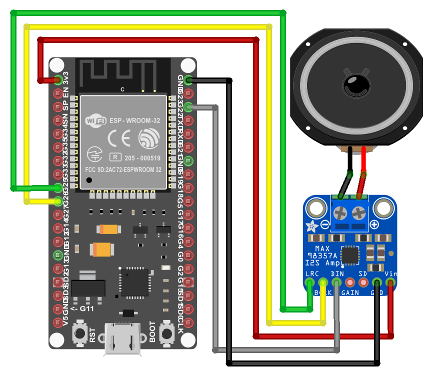
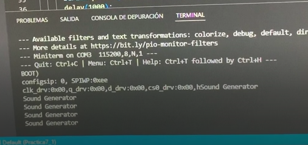
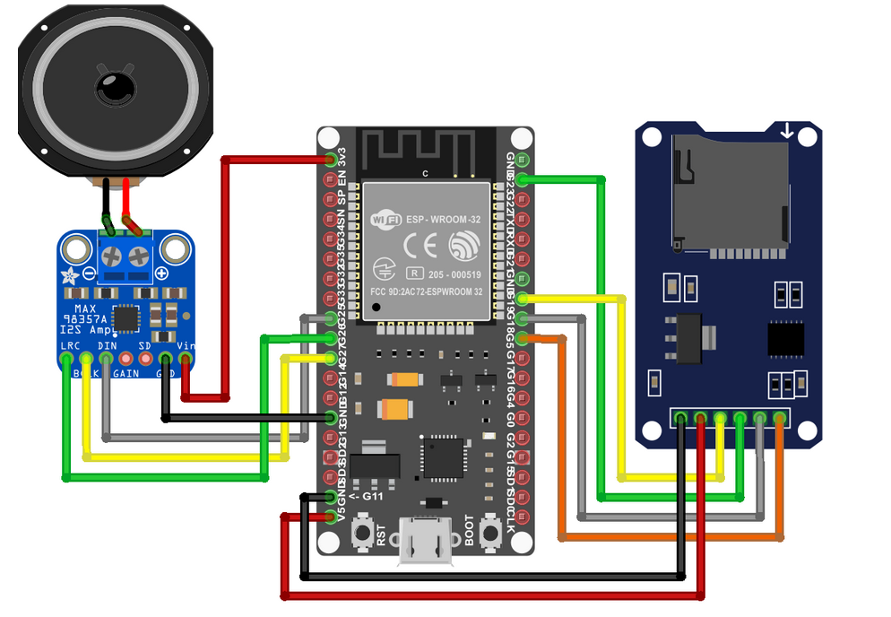

### Oriol Garcia Moreiras
###                                    

    Processadors Digitals

#   PRÁCTICA 7 : Buses de comunicación III (I2S)

## Materiales

Placa ESP32 y cable para conectarla al ordenador, 
MAX 98357A,
Altavoces,
Microsd,
Lector de microsd,
Cables y
1 Protoboard

##   7.1 Reproducción desde memoria interna
#include "Arduino.h"
#include "AudioGeneratorAAC.h"
#include "AudioOutputI2S.h"
#include "AudioFileSourcePROGMEM.h"
#include "sampleaac.h"
#include "FS.h"
#include "HTTPClient.h"
#include "SPIFFS.h"
#include "SD.h"
#include "SPI.h"

AudioFileSourcePROGMEM *in;
AudioGeneratorAAC *aac;
AudioOutputI2S *out;

void setup(){

  Serial.begin(115200);
  in = new AudioFileSourcePROGMEM(sampleaac, sizeof(sampleaac));
  aac = new AudioGeneratorAAC();
  out = new AudioOutputI2S();
  out -> SetGain(0.900);
  out -> SetPinout(26,25,22);
  aac->begin(in, out);

}

void loop(){

  if (aac->isRunning()) {
    aac->loop();
    } 
  else {
      aac -> stop();
      Serial.printf("Sound Generator\n");
      delay(1000);
  }
}

##   7.2 Reproducir un archivo WAVE en ESP32 desde una tarjeta SD externa
#include "Audio.h"
#include "SD.h"
#include "FS.h"

// Digital I/O used
#define SD_CS          5
#define SPI_MOSI      23
#define SPI_MISO      19
#define SPI_SCK       18
#define I2S_DOUT      25
#define I2S_BCLK      27
#define I2S_LRC       26

Audio audio;

void setup(){
    pinMode(SD_CS, OUTPUT);
    digitalWrite(SD_CS, HIGH);
    SPI.begin(SPI_SCK, SPI_MISO, SPI_MOSI);
    Serial.begin(115200);
    SD.begin(SD_CS);
    audio.setPinout(I2S_BCLK, I2S_LRC, I2S_DOUT);
    audio.setVolume(10); // 0...21
    audio.connecttoFS(SD, "Ensoniq-ZR-76-01-Dope-77.wav");
}

void loop(){
    audio.loop();
}

// optional
void audio_info(const char *info){
    Serial.print("info        "); Serial.println(info);
}
void audio_id3data(const char *info){  //id3 metadata
    Serial.print("id3data     ");Serial.println(info);
}
void audio_eof_mp3(const char *info){  //end of file
    Serial.print("eof_mp3     ");Serial.println(info);
}
void audio_showstation(const char *info){
    Serial.print("station     ");Serial.println(info);
}
void audio_showstreamtitle(const char *info){
    Serial.print("streamtitle ");Serial.println(info);
}
void audio_bitrate(const char *info){
    Serial.print("bitrate     ");Serial.println(info);
}
void audio_commercial(const char *info){  //duration in sec
    Serial.print("commercial  ");Serial.println(info);
}
void audio_icyurl(const char *info){  //homepage
    Serial.print("icyurl      ");Serial.println(info);
}
void audio_lasthost(const char *info){  //stream URL played
    Serial.print("lasthost    ");Serial.println(info);
}
void audio_eof_speech(const char *info){
    Serial.print("eof_speech  ");Serial.println(info);
}

##   Reproducción desde memoria interna

Para realizar esta parte necesitaremos conectar la ESP32, los altavoces y el MAX 98357A de la siguiente forma:

Circuito visual:

Una vez conectado de forma correcta haremos el upload and monitor y comprobaremos que el audio que tenemos guardado sampleaac.h se reproduzca de forma correcta por los altavoces que tenemos conectados. 

A continuación se muestra la salida por el puerto serie:

Resaltar que en el video se ve el circuito en persona y se escucha el sonido que se reproduce. 

Por último, aclarar que el volumen de los altavoces depende de la ganancia que pongamos.

##   Reproducir un archivo WAVE en ESP32 desde una tarjeta SD externa

Para esta segunda parte tendremos que agregar el lector de la targeta microSD, asi que el circuito quedaría de la siguiente manera:

Circuito visual:

Una vez conectado de manera correcta haremos el upload and monitor y en teoría se tendría que reproducir el audio que tenemos guardado en la microSD, pero como yo ya bien he dicho en el video, esta me ha dado problemas debido a la gran capacidad que tiene (8gb). Por lo tanto, no he podido comprobar el resultado final del circuito.

Como el resultado final me daba error debido a la microSD no puedo mostrar la salida por el puerto serie.