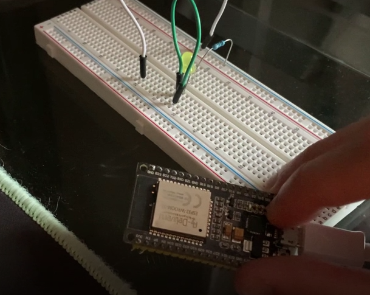
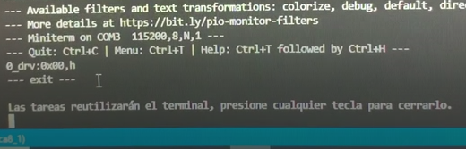

### Oriol Garcia Moreiras
###                                    

    Processadors Digitals

#   PRÁCTICA 8 : Buses de comunicación IV (uart)

## Materiales

Placa ESP32 y cable para conectarla al ordenador, 
1 Resistencia (en mi caso 330 ohms), 
1 LED, 
Cables y
Protoboard

##   8. Código bucle de comunicacion uart2

#include <Arduino.h>

char dato1;
char dato2;

void setup() {

  Serial.begin(115200);
  Serial2.begin(115200);
  
}

void loop() {

  while (Serial.available())
  {
    dato1 = Serial.read();
    Serial2.write(dato1);

    delay(1);

    if(Serial2.available()){

      dato2 = Serial2.read();
      Serial.write(dato2);
    }
  }
  }
  

##   Bucle de comunicacion uart2
En esta práctica veremos como realizar un bucle de comunicación de forma que los datos que se manden por el terminal rxd0 se redirijan a la uart 2 txd2 ( que debe estar conectado a rxd2 ) y la recepción de los datos de la uart2 se reenvíen de nuevo a la salida txd0 para que aparezcan en la pantalla del terminal

A continuación explicará el código generado:

Primero de todo tenemos que crear dos variables char, los cuales serán los datos que se manden por el terminal rxd0 y los de la uart2:

char dato1;
char dato2;

A continuación abrimos un bucle en cuál va a ver si hay algún dato en la primera terminal:

while (Serial.available())

Dentro de este bucle compararemos el dato1 con lo que lee el terminal rdx0 y lo copiaremos/enviaremos a la uart 2 txd2:

dato1 = Serial.read();
Serial2.write(dato1);

Aplicamos un delay de 1 milisegundo:
delay(1);

Y volvemos a hacer la misma comparación, pero con el dato2 y lo enviamos al terminal rxd0:

if(Serial2.available()){

dato2 = Serial2.read();
Serial.write(dato2);
}

Por lo tanto, finalmente tendríamos los datos del terminal rdx0 en la uart2 y al revés.

Circuito:

Salida:

Básicamente es un menú, el cual hará la función que hemos dicho anteriormente.